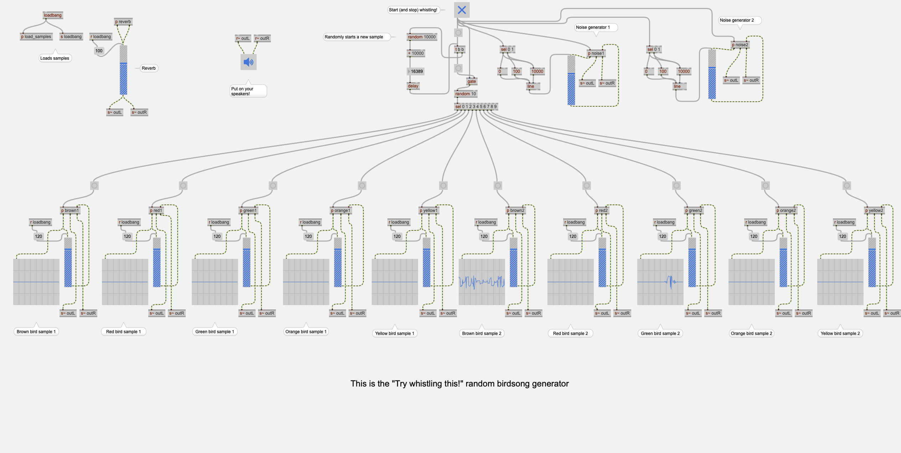
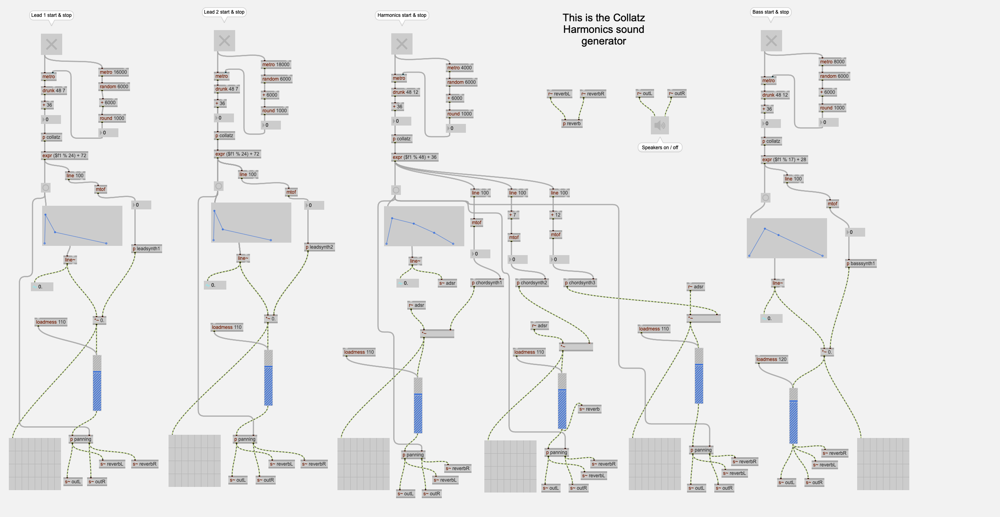

# Generative Soundscape System (Max/MSP)

This repository contains two autonomous generative sound generators developed in Max/MSP as part of my Master’s thesis in Computer Science at Tampere University.

The project explores the combination of rule-based (deterministic) and stochastic processes in the design of real-time generative soundscapes. The system was developed following a Design Science Research (DSR) approach and demonstrates how visual dataflow programming can be used to construct transparent, modular, and analyzable generative audio systems.

## Try Whistling This!

A sample-based generative soundscape that uses randomized bird song samples. Playback order, timing, pitch variation, and spatial placement are controlled through stochastic processes, creating an evolving and organic ambient texture.

Main patch view:

## Collatz Harmonics

A synthesis-based sound generator that uses the Collatz conjecture as a deterministic algorithm for pitch generation. The resulting numerical sequences are mapped to musical parameters, producing harmonically evolving structures shaped by both mathematical rules and controlled randomness.

Main patch view:

## Documentation

Additional screenshots of subpatches are available in each generator’s Media/ folder.

## Technical Information

Developed in Max/MSP

Real-time audio generation

Modular dataflow architecture

Combines deterministic algorithms and stochastic modulation

## Demo

Collatz Harmonics: https://youtu.be/Z08BplgWCKc

Try Whistling This!: https://youtu.be/R4yucOizmew
